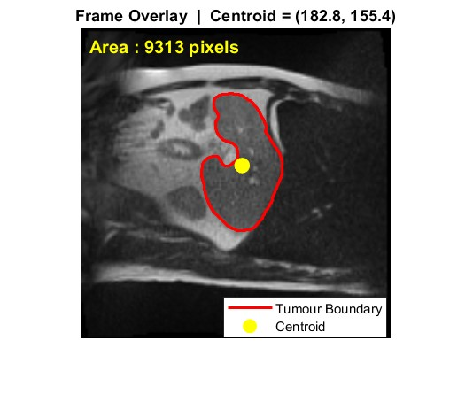
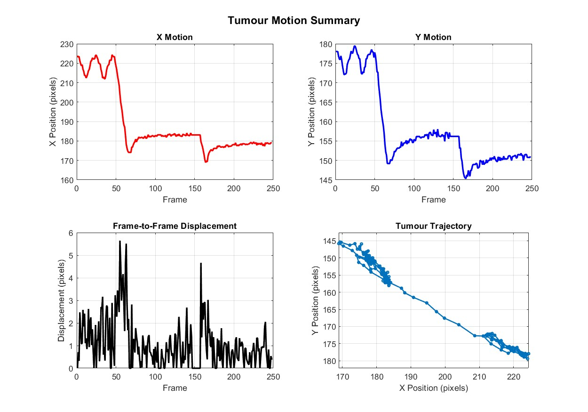

# CineMRI-Feature-Extraction
Open-source MATLAB toolkit for cine-MRI analysis, tumour motion quantification, feature extraction, and visualization for MR-guided radiotherapy research.

## Overview

This repository provides a collection of MATLAB functions for quantitative analysis of tumour motion in cine-MRI sequences. The toolbox is designed for extracting geometric and motion-related features from segmented tumour masks and generating visualizations suitable for research, quality assurance, and educational purposes.

The code has been developed as part of research in image-guided radiotherapy and demonstrates a modular workflow for cine-MRI data analysis.

## Features

Tumour centroid extraction;
Shape feature extraction: Area, Perimeter, Circularity, Eccentricity, Major/Minor axis length, Solidity, Extent
Tumour motion trajectory analysis;
Motion statistics computation;
Tumour boundary visualization;
Motion summary plots;
CSV export of extracted features;
MP4 video generation of tumour motion.

## Repository Structure
CineMRI-Feature-Extraction/
│
├── src/
│   MATLAB source functions
│
├── examples/
│   Example scripts demonstrating usage
│
├── sample_results/
│   Example outputs (CSV, video)
│
└── docs/
    └── figures/

## Requirements

MATLAB R2023b (or later)
Image Processing Toolbox

## Quick Start
% Load image and mask
img = mha_read_volume('images.mha');
mask = mha_read_volume('labels.mha');

% Extract tumour motion
motion = extract_motion_signal(mask);

% Plot summary
plot_motion_summary(motion);

## Example Workflow
1. Load cine-MRI image sequence.
2. Load corresponding tumour segmentation masks.
3. Extract tumour centroid.
4. Compute geometric features.
5. Quantify tumour motion.
6. Generate motion statistics and visualizations.
7. Export extracted features to CSV.
8. Create an MP4 visualization of tumour motion.

## Example Outputs

- Tumour overlay visualization
- Motion summary plots
- CSV feature table
- MP4 motion video

---

## Results

### Tumour Overlay

### Motion Summary

Example figures are available in the 'docs/figures' directory.

## Applications
This toolbox can be used for
MR-guided radiotherapy research,
Tumour motion characterization,
Respiratory motion analysis,
Image-guided adaptive radiotherapy,
Feature extraction for machine learning workflows,
Educational demonstrations of cine-MRI analysis

## Dataset
The toolbox was developed and tested using cine-MRI tumour segmentation data.

**Note:** The dataset is **not included** in this repository. Users should obtain the appropriate dataset from its official source and comply with the corresponding license and usage terms.

## Future Development
Planned extensions include: Texture feature extraction, Radiomics integration, Deep learning interfaces, Motion prediction models, Advanced visualization tools

## Citation
If you use this toolbox in your research, please cite:
-> Aindrila Paul Chowdhury, *CineMRI-Feature-Extraction*, GitHub repository.

## License
This project is released under the MIT License.

## Author
**Aindrila Paul Chowdhury**

Research interests:
-> Medical Physics
-> Image-Guided Radiotherapy
-> Cine-MRI Motion Analysis
-> Medical Image Processing
-> Machine Learning for Medical Imaging
-> Computational Modelling
